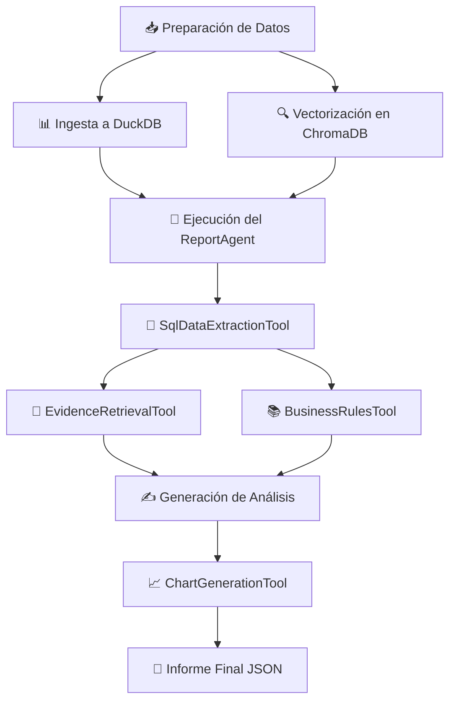

# 🧠 Report Generator
### Sistema Modular de Generación de Informes Ejecutivos y Técnicos

<div align="center">

[](https://www.python.org/downloads/)
[]()

</div>

---

## 📋 Descripción General

**Report Generator** es un sistema inteligente orquestado por agentes que genera informes ejecutivos y técnicos de alta calidad a partir de múltiples fuentes de datos. El sistema integra hojas de cálculo Excel, evidencia multimodal (documentos e imágenes) y reglas de negocio para proporcionar análisis completos y accionables.

> 💡 **Nota**: Este documento ofrece una visión general del proyecto. Para obtener detalles más profundos, como los prompts utilizados, los contratos entre módulos y guías de integración extendidas, consulta la **Wiki del proyecto**.

---

## 📑 Tabla de Contenidos

- [🎯 Propósito y Alcance](#-propósito-y-alcance)
- [🏗️ Arquitectura y Componentes](#️-arquitectura-y-componentes)
- [🔄 Flujo Operativo End-to-End](#-flujo-operativo-end-to-end)
- [🚀 Instalación y Puesta en Marcha](#-instalación-y-puesta-en-marcha)
- [📁 Estructura del Proyecto](#-estructura-del-proyecto)
- [🔑 Configuración Clave](#-configuración-clave)
- [🪵 Observabilidad y Trazabilidad](#-observabilidad-y-trazabilidad)
- [🗺️ Estado Actual y Próximos Pasos](#️-estado-actual-y-próximos-pasos)
- [🤝 Colaboración y Contribución](#-colaboración-y-contribución)

---

## 🗺️ Estado Actual y Próximos Pasos

### 📍 Dónde Estamos (MVP - Base Técnica)

El sistema actual es funcional y cubre el ciclo completo de análisis:

```
[Excel/Docs] → [ETL] → [DuckDB/ChromaDB] → [Agente IA] → [Reporte JSON]

```

**Limitaciones Actuales**:
- ⚠️ Ejecución manual (no automática)
- ⚠️ Usa modelos LLM gratuitos con límites de tokens
- ⚠️ No integrado con sistemas de ticketing en tiempo real
- ⚠️ Interfaz CLI (sin UI web)

**Lo que SÍ funciona**:
- ✅ Procesa datos de múltiples consultores
- ✅ Analiza evidencia con modelos de visión
- ✅ Genera diagnósticos técnicos de calidad
- ✅ Reutiliza soluciones históricas
- ✅ Escalable a otros proyectos

---

## 🎯 Propósito y Alcance

### Problema que Resuelve

En proyectos de implementación de software empresarial, el ciclo de atención de defectos/hallazgos presenta múltiples ineficiencias:

1. **Bloqueo de usuarios**: Al reportar un problema, el usuario queda bloqueado esperando clasificación y respuesta
2. **Pérdida de tiempo**: Reuniones de diagnóstico, idas y vueltas para entender el problema, búsqueda de responsables
3. **Clasificación tardía**: Demora en identificar si es técnico, funcional o administrativo
4. **Conocimiento disperso**: Soluciones y diagnósticos previos no se reutilizan eficientemente

### Solución Propuesta

Este sistema automatiza el **análisis inicial de defectos** mediante:

**Procesamiento Inteligente**
- Extracción automática de datos estructurados (SQL/DuckDB)
- Análisis de evidencia multimodal (documentos Word/PDF, capturas de pantalla)
- Búsqueda semántica en base de conocimiento (reglas de negocio, soluciones previas)

**Diagnóstico Automatizado**
- Clasificación automática del tipo de problema
- Generación de hipótesis de causa raíz
- Planes de acción basados en casos históricos similares
- Identificación de responsables y recursos necesarios

**Generación de Reportes**
- Resumen ejecutivo para PMOs/líderes de proyecto
- Análisis técnico detallado por defecto
- Recomendaciones accionables priorizadas
- Visualizaciones de datos (distribución por estado, módulo, antigüedad)

### Alcance Actual (Base Técnica)

| Componente | Estado | Descripción |
|------------|--------|-------------|
| **Ingesta de Datos** | ✅ Implementado | ETL de Excel → DuckDB, vectorización de documentos |
| **RAG System** | ✅ Implementado | ChromaDB con búsqueda semántica en evidencia y reglas |
| **Agente Inteligente** | ✅ Implementado | ReportAgent con razonamiento adaptativo (LLM) |
| **Generación de Reportes** | ✅ Implementado | Resúmenes ejecutivos y recomendaciones técnicas |
| **Proveedores IA** | ✅ Implementado | Soporte para Ollama (local) y Cerebras/Gemini (cloud) |


### Beneficios Esperados

- ⏱️ **Reducción de tiempo de respuesta**: De horas/días a minutos
- 🎯 **Mayor precisión**: Diagnósticos basados en histórico de casos similares
- 📚 **Reutilización de conocimiento**: Soluciones previas aplicadas automáticamente
- 🔄 **Escalabilidad**: El mismo sistema funciona en múltiples proyectos
- 💰 **Reducción de costos**: Nivel 1 (1.5) de soporte automatizado

---

## 🏗️ Arquitectura y Componentes

El proyecto está organizado en capas bien definidas con responsabilidades claras:

### 1️⃣ Capa de Agentes (`app/agents`)

#### ReportAgent
Orquestador principal que:
- Analiza las solicitudes entrantes
- Decide qué herramientas utilizar en cada paso
- Ejecuta el plan de acción
- Compila el informe final

#### BaseAgent
Proporciona la lógica fundamental:
- Ciclo de razonamiento: **Pensamiento → Acción → Observación**
- Registro estructurado de logs
- Gestión de la memoria de ejecución
- Validación de acciones

---

### 2️⃣ Capa de Herramientas (`app/tools`)

Las herramientas son módulos funcionales que el ReportAgent puede invocar:

| Herramienta | Función |
|------------|---------|
| `SqlDataExtractionTool` | Genera y ejecuta consultas SQL sobre DuckDB para obtener datos de defectos |
| `EvidenceRetrievalTool` | Recupera chunks de evidencia multimodal desde ChromaDB |
| `BusinessRulesTool` | Realiza búsqueda semántica (RAG) para reglas de negocio |
| `SummaryGenerationTool` | Genera resúmenes ejecutivos utilizando el LLM |
| `RecommendationsGenerationTool` | Produce recomendaciones técnicas especializadas |
| `ChartGenerationTool` | Transforma datos tabulares en objetos de visualización JSON |

---

### 3️⃣ Capa de ETL y Vectorización (`app/core/etl`)

Procesa datos crudos y los prepara para su uso:

```
📥 INGESTA DE DATOS
├── Excel → DuckDB
│   └── Limpieza de columnas y contenido textual
├── Knowledge Base (SQL)
│   └── Generación de Markdown optimizado para vectorización
├── Business Rules (PDF/TXT/MD)
│   └── Segmentación y vectorización en ChromaDB
└── Evidencia Multimodal (DOCX, PDF, Imágenes)
    └── Extracción de texto, tablas y descripción de imágenes
```

---

### 4️⃣ Capa de Proveedores de IA (`app/core/ia`)

Abstrae la comunicación con modelos de IA:

| Tipo | Proveedores Compatibles |
|------|------------------------|
| **LLM** | Cerebras (API), Ollama (local) |
| **Embeddings** | Gemini (API), Ollama (local) |
| **Visión** | Ollama (descripción de imágenes) |

---

### 5️⃣ Capa de Persistencia de Datos

- **DuckDB**: Datos estructurados de Excel  
  📂 `data_store/etl_store/duckdb_data`

- **ChromaDB**: Base de datos vectorial  
  📂 `data_store/etl_store/vector_store`

---

## 🔄 Flujo Operativo End-to-End



### Proceso Detallado

#### **Fase 1: Preparación de Datos (ETL)**
1. Carga de archivos Excel en carpeta `uploads`
2. Ingesta en DuckDB
3. Procesamiento de reglas de negocio y evidencia multimodal
4. Vectorización y almacenamiento en ChromaDB

#### **Fase 2: Ejecución del Agente**
1. Invocación del ReportAgent con nombre del consultor
2. Extracción de datos de defectos desde DuckDB
3. Recuperación de evidencia multimodal asociada
4. Búsqueda de reglas de negocio relevantes
5. Generación de análisis y recomendaciones
6. Creación de visualizaciones

#### **Fase 3: Resultado**
- Compilación de resultados en JSON estructurado
- Incluye: resumen, recomendaciones, datos de soporte y gráficos

---

## 🚀 Instalación y Puesta en Marcha

### Prerrequisitos

| Requisito | Versión | Descripción |
|-----------|---------|-------------|
| **Python** | 3.10+ | Lenguaje base del proyecto |
| **Git** | Latest | Control de versiones |
| **Ollama** | Latest | (Opcional) Modelos de IA locales |

### Paso 1️⃣: Clonar el Repositorio

```bash
git clone https://github.ibm.com/jegarciag/IA_Saphiro.git
cd report_generator_demo
```

### Paso 2️⃣: Configurar el Entorno Virtual

```bash
# Crear entorno virtual
python -m venv venv

# Activar entorno virtual
# Windows:
venv\Scripts\activate

# macOS/Linux:
source venv/bin/activate
```

### Paso 3️⃣: Instalar Dependencias

```bash
pip install -r requirements.txt
```

### Paso 4️⃣: Crear Estructura de Directorios

```bash
python scripts/setup_project.py
```

### Paso 5️⃣: Configurar Variables de Entorno

Crea un archivo `.env` en la raíz del proyecto:

```env
# === PROVEEDORES DE IA ===
LLM_PROVIDER="ollama"                 # O "cerebras"
EMBEDDING_PROVIDER="ollama"           # O "gemini"
VISION_PROVIDER="ollama"

# === MODELOS ===
LLM_MODEL_NAME="llama-3.3-70b"
EMBEDDING_MODEL="nomic-embed-text"
VISION_MODEL_NAME="gemma3:4b"

# === CLAVES DE API ===
CEREBRAS_API_KEY="TU_API_KEY_DE_CEREBRAS"
GEMINI_API_KEY="TU_API_KEY_DE_GEMINI"

# === CONFIGURACIÓN OLLAMA ===
OLLAMA_HOST="http://localhost:11434"

# === SELENIUM (Extracción de Evidencia) ===
DEBUGGER_ADDRESS="localhost:9222"
DEBUG_MODE="False"
```

### Paso 6️⃣: Instalar Modelos de Ollama (Opcional)

```bash
ollama pull nomic-embed-text
ollama pull gemma3:4b
```

### Paso 7️⃣: Ejecución

```bash
# Ejecutar pipelines de ETL
python scripts/test/vectorize/run_etl_vectorize_business.py
python scripts/test/vectorize/run_etl_vectorize_excel.py --step all

#IMPORTANTE
CAMBIAR LA RUTA DEL DOCS, QUE ESTA EN EL PROPIO ARCHIVO.
python scripts/test/vectorize/debug_multimodal_pipeline.py

# Generar informes
python scripts/generate_report_v2.py --consultant "YARLEN ASTRID ALVAREZ BUILES (203)" --print-summary
```

---

## 📁 Estructura del Proyecto

```
report_generator_demo/
│
├── app/                          # Núcleo de la aplicación
│   ├── agents/                   # Lógica de agentes
│   │   ├── base_agent.py
│   │   └── report_agent.py
│   ├── tools/                    # Herramientas especializadas
│   ├── core/                     # Componentes centrales
│   │   ├── etl/                  # Scripts de ingesta y vectorización
│   │   ├── ia/                   # Abstracciones de proveedores IA
│   │   └── report_generator/    # RAG, prompts y gráficos
│   └── config/                   # Archivos de configuración
│
├── data_store/                   # Almacén de datos persistentes
│   ├── etl_store/
│   │   ├── duckdb_data/          # Base de datos DuckDB
│   │   └── vector_store/         # Vectores ChromaDB
│   └── logs/                     # Logs estructurados
│
├── scripts/                      # Scripts de utilidad
│   ├── setup_project.py
│   ├── run_etl.py
│   └── generate_report.py
│
├── .env                          # Variables de entorno
├── requirements.txt              # Dependencias Python
└── README.md                     # Este archivo
```

---

## 🔑 Configuración Clave

| Archivo | Propósito |
|---------|-----------|
| `app/config/settings.py` | Proveedores de IA, modelos y límites de procesamiento |
| `app/config/settings_etl.py` | Rutas del data_store, ubicación de DuckDB y colecciones ChromaDB |
| `.env` | Variables de entorno sensibles (claves de API) |

---

## 🪵 Observabilidad y Trazabilidad

El proyecto incluye un sistema de logging robusto:

### Características de Logging

- ✅ **Logs Estructurados**: Cada flujo genera logs detallados en `data_store/logs`
- ✅ **Metadatos de Ejecución**: Archivos JSON con pasos ejecutados, tiempos y resultados
- ✅ **Logs de Vectorización**: Logs específicos de ETL en `data_store/logs_vectorization`
- ✅ **Trazabilidad Completa**: Seguimiento de cada operación del agente

### Ubicación de Logs

```
data_store/
├── logs/                         # Logs de ejecución general
└── logs_vectorization/           # Logs de procesos ETL
```

---

## 🤝 Colaboración y Contribución

### Directrices de Contribución

#### ✅ Commits Atómicos
Realiza cambios pequeños y descriptivos con mensajes claros:
```
feat: agregar soporte para archivos CSV
fix: corregir error en extracción de imágenes
docs: actualizar README con nuevas instrucciones
refactor: optimizar procesamiento de chunks multimodales
```

#### ✅ Pull Requests Detallados
Cada PR debe incluir:
- 📝 Descripción clara del propósito
- 🎯 Impacto en el sistema
- ✔️ Validaciones realizadas
- 🧪 Casos de prueba

#### ✅ Validación Mínima
Antes de enviar un PR:
1. Ejecuta los pipelines de ETL
2. Verifica la generación de reportes con datos de prueba
3. Revisa los logs de ejecución
4. Valida que no hay regresiones en funcionalidad existente
5. Ejecuta `python -m pytest` si hay tests disponibles

#### ✅ Estilo de Código
- Sigue los patrones de nombres existentes
- Mantén la modularidad
- Documenta funciones complejas con docstrings
- Utiliza type hints en Python
- Máximo 100 caracteres por línea

### 🏢 Contexto Empresarial

**Aplicabilidad**: Este sistema está diseñado para proyectos de implementación de software empresarial (SAP, Oracle, etc.) donde:
- Existen múltiples consultores especializados
- Se manejan grandes volúmenes de defectos/hallazgos
- Hay evidencia documental extensa (Word, PDF, screenshots)
- Se requiere clasificación técnica/funcional/administrativa

**Escalabilidad**: El código está preparado para:
- Adaptarse a diferentes clientes (no hard-coded para un proyecto específico)
- Soportar múltiples módulos SAP (FI, CO, MM, SD, etc.)
- Integrarse con diferentes sistemas de ticketing
- Funcionar en modo local (Ollama) o cloud (Cerebras/Gemini)

---

## 📚 Recursos Adicionales

- 📖 **Wiki del Proyecto**: Documentación detallada de prompts y contratos entre módulos
- 🐛 **Issue Tracker**: Reporta bugs o solicita features
- 💬 **Discussions**: Comparte ideas y mejoras
- 📊 **Project Board**: Seguimiento de roadmap y tareas

### 🔗 Enlaces Útiles

- [Documentación de ChromaDB](https://docs.trychroma.com/)
- [Ollama Models](https://ollama.com/library)
- [watsonx Assistant API](https://cloud.ibm.com/docs/watson-assistant)
- [LangChain Documentation](https://python.langchain.com/)

---

## ⚠️ Disclaimer

Este es un **proyecto en desarrollo activo**. La arquitectura y funcionalidades pueden cambiar significativamente entre versiones. Se recomienda:
- Revisar la Wiki antes de hacer cambios importantes
- Sincronizar frecuentemente con el equipo
- No usar en producción sin revisión exhaustiva
- Consultar sobre integraciones con sistemas externos

---

## 📄 Licencia

Este proyecto es propiedad de IBM y está sujeto a sus políticas internas de uso de código.

---

<div align="center">

**Desarrollado como base técnica para automatización de soporte en proyectos de software empresarial**

</div>
